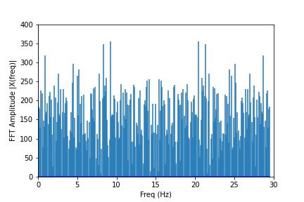
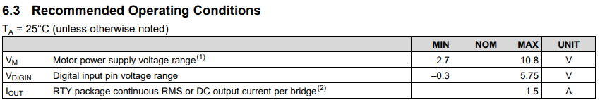

<!DOCTYPE html>
<html lang="en">
    <head>
        <meta charset="utf-8" />
        <meta name="viewport" content="width=device-width, initial-scale=1, shrink-to-fit=no" />
        <meta name="description" content="" />
        <meta name="author" content="" />
        <title>Fast Robots - Ruohan Liu</title>
        <!-- Favicon-->
        <link rel="icon" type="image/x-icon" href="assets/favicon.ico" />
        <!-- Font Awesome icons (free version)-->
        
        <!-- Google fonts-->
        <link href="https://fonts.googleapis.com/css?family=Montserrat:400,700" rel="stylesheet" type="text/css" />
        <link href="https://fonts.googleapis.com/css?family=Lato:400,700,400italic,700italic" rel="stylesheet" type="text/css" />
        <!-- Core theme CSS (includes Bootstrap)-->
        <link href="css/styles.css" rel="stylesheet" />
    </head>
    <body id="page-top">
        <!-- Navigation-->
        <nav class="navbar navbar-expand-lg bg-secondary text-uppercase fixed-top" id="mainNav">
            

                <a class="navbar-brand" href="#page-top">ECE5960: Fast Robots</a>
                <button class="navbar-toggler text-uppercase font-weight-bold bg-primary text-white rounded" type="button" data-bs-toggle="collapse" data-bs-target="#navbarResponsive" aria-controls="navbarResponsive" aria-expanded="false" aria-label="Toggle navigation">
                    Menu
                    <i class="fas fa-bars"></i>
                </button>
                

                    <ul class="navbar-nav ms-auto">
                        <li class="nav-item mx-0 mx-lg-1"><a class="nav-link py-3 px-0 px-lg-3 rounded" href="#labs">LABS</a></li>
                        <li class="nav-item mx-0 mx-lg-1"><a class="nav-link py-3 px-0 px-lg-3 rounded" href="#about">About</a></li>
                        <li class="nav-item mx-0 mx-lg-1"><a class="nav-link py-3 px-0 px-lg-3 rounded" href="#contact">Contact</a></li>
                    </ul>
                

            

        </nav>
        <!-- Masthead-->
        <header class="masthead bg-primary text-white text-center">
            

                <!-- Masthead Avatar Image-->
                <!--  -->
                <!-- Masthead Heading-->
                <h1 class="masthead-heading text-uppercase mb-0">RUOHAN LIU</h1>
                <!-- Icon Divider-->
                

                    

                    
<i class="fas fa-star"></i>

                    

                

                <!-- Masthead Subheading-->
                
ECE MEng student

                
rl592@cornell.edu - Ithaca, NY

                
Course : ECE 5960 - Fast Robots - Spring 2022

            

        </header>
        <!-- Portfolio Section-->
        <section class="page-section labs" id="labs">
            

                <!-- Portfolio Section Heading-->
                <h2 class="page-section-heading text-center text-uppercase text-secondary mb-0">LABS</h2>
                <!-- Icon Divider-->
                

                    

                    
<i class="fas fa-star"></i>

                    

                

                <!-- Portfolio Grid Items-->
                

                    <!-- Portfolio Item 1-->
                    

                        

                            

                                
<i class="fas fa-plus fa-3x"></i>

                            

                            

                            <h3 class=" text-center  mb-0">Lab1 : Artemis</h3>
                            
                        

                    

                    <!-- Portfolio Item 2-->
                    

                        

                            

                                
<i class="fas fa-plus fa-3x"></i>

                            

                            <!--  -->
                            
                            <h3 class=" text-center  mb-0">Lab2 : Bluetooth</h3>

                        

                    

                    <!-- Portfolio Item 3-->
                    

                        

                            

                                
<i class="fas fa-plus fa-3x"></i>

                            

                            
                            <h3 class=" text-center  mb-0">Lab3 : Sensors</h3>
                        

                    

                    <!-- Portfolio Item 4-->
                    

                        

                            

                                
<i class="fas fa-plus fa-3x"></i>

                            

                            
                            <h3 class=" text-center  mb-0">Lab4 : Characterize your car</h3>
                        

                    

                    <!-- Portfolio Item 5-->
                    

                        

                            

                                
<i class="fas fa-plus fa-3x"></i>

                            

                            
                            <h3 class=" text-center  mb-0">Lab5 : Motor driver and open loop control</h3>

                        

                    

                    <!-- Portfolio Item 6-->
                    

                        

                            

                                
<i class="fas fa-plus fa-3x"></i>

                            

                            
                            <h3 class=" text-center  mb-0">Lab6 : PID speed control</h3>

                        

                    

                    <!-- Portfolio Item 7-->
                    

                        

                            

                                
<i class="fas fa-plus fa-3x"></i>

                            

                            

                            <h3 class=" text-center  mb-0">Lab7 : Kalman filters</h3>
                            
                        

                    

                    <!-- Portfolio Item 8-->
                    

                        

                            

                                
<i class="fas fa-plus fa-3x"></i>

                            

                            
                            <h3 class=" text-center  mb-0">Lab8 : Stunts</h3>

                        

                    

                    <!-- Portfolio Item 9-->
                    

                        

                            

                                
<i class="fas fa-plus fa-3x"></i>

                            

                            
                            <h3 class=" text-center  mb-0">Lab9 : Mapping</h3>
                        

                    

                    <!-- Portfolio Item 10-->
                    

                        

                            

                                
<i class="fas fa-plus fa-3x"></i>

                            

                            
                            <h3 class=" text-center  mb-0">Lab10 : Simulator</h3>
                        

                    

                    <!-- Portfolio Item 11-->
                    

                        

                            

                                
<i class="fas fa-plus fa-3x"></i>

                            

                            
                            <h3 class=" text-center mb-0">Lab11 : Localization (sim)</h3>

                        

                    

                    <!-- Portfolio Item 12-->
                    

                        

                            

                                
<i class="fas fa-plus fa-3x"></i>

                            

                            
                            <h3 class=" text-center  mb-0">Lab12 : Localization (real)</h3>

                        

                    

                    <!-- Portfolio Item 13-->
                    

                        

                            

                                
<i class="fas fa-plus fa-3x"></i>

                            

                            
                            <h3 class=" text-center mb-0">Lab13 : Planning and Execution</h3>

                        

                    

                

            

        </section>
        <!-- About Section-->
        <section class="page-section bg-primary text-white mb-0" id="about">
            

                <!-- About Section Heading-->
                <h2 class="page-section-heading text-center text-uppercase text-white">About</h2>
                <!-- Icon Divider-->
                

                    

                    
<i class="fas fa-star"></i>

                    

                

                <!-- About Section Content-->
                

                    

Freelancer is a free bootstrap theme created by Start Bootstrap. The download includes the complete source files including HTML, CSS, and JavaScript as well as optional SASS stylesheets for easy customization.

                    

You can create your own custom avatar for the masthead, change the icon in the dividers, and add your email address to the contact form to make it fully functional!

                

                <!-- About Section Button-->
                

                    <a class="btn btn-xl btn-outline-light" href="https://startbootstrap.com/theme/freelancer/">
                        <i class="fas fa-download me-2"></i>
                        Free Download!
                    </a>
                

            

        </section>
        <!-- Contact Section-->
        <section class="page-section" id="contact">
            

                <!-- Contact Section Heading-->
                <h2 class="page-section-heading text-center text-uppercase text-secondary mb-0">Contact Me</h2>
                <!-- Icon Divider-->
                

                    

                    
<i class="fas fa-star"></i>

                    

                

                <!-- Contact Section Form-->
                

                    

                        <!-- * * * * * * * * * * * * * * *-->
                        <!-- * * SB Forms Contact Form * *-->
                        <!-- * * * * * * * * * * * * * * *-->
                        <!-- This form is pre-integrated with SB Forms.-->
                        <!-- To make this form functional, sign up at-->
                        <!-- https://startbootstrap.com/solution/contact-forms-->
                        <!-- to get an API token!-->
                        <form id="contactForm" data-sb-form-api-token="API_TOKEN">
                            <!-- Name input-->
                            

                                <input class="form-control" id="name" type="text" placeholder="Enter your name..." data-sb-validations="required" />
                                <label for="name">Full name</label>
                                
A name is required.

                            

                            <!-- Email address input-->
                            

                                <input class="form-control" id="email" type="email" placeholder="name@example.com" data-sb-validations="required,email" />
                                <label for="email">Email address</label>
                                
An email is required.

                                
Email is not valid.

                            

                            <!-- Phone number input-->
                            

                                <input class="form-control" id="phone" type="tel" placeholder="(123) 456-7890" data-sb-validations="required" />
                                <label for="phone">Phone number</label>
                                
A phone number is required.

                            

                            <!-- Message input-->
                            

                                <textarea class="form-control" id="message" type="text" placeholder="Enter your message here..." style="height: 10rem" data-sb-validations="required"></textarea>
                                <label for="message">Message</label>
                                
A message is required.

                            

                            <!-- Submit success message-->
                            <!---->
                            <!-- This is what your users will see when the form-->
                            <!-- has successfully submitted-->
                            

                                

                                    
Form submission successful!

                                    To activate this form, sign up at
                                     
                                    <a href="https://startbootstrap.com/solution/contact-forms">https://startbootstrap.com/solution/contact-forms</a>
                                

                            

                            <!-- Submit error message-->
                            <!---->
                            <!-- This is what your users will see when there is-->
                            <!-- an error submitting the form-->
                            

Error sending message!

                            <!-- Submit Button-->
                            <button class="btn btn-primary btn-xl disabled" id="submitButton" type="submit">Send</button>
                        </form>
                    

                

            

        </section>
        <!-- Footer-->
        <footer class="footer text-center">
            

                

                    <!-- Footer Location-->
                    

                        <h4 class="text-uppercase mb-4">Location</h4>
                        

                            2215 John Daniel Drive
                             
                            Clark, MO 65243
                        

                    

                    <!-- Footer Social Icons-->
                    

                        <h4 class="text-uppercase mb-4">Around the Web</h4>
                        <a class="btn btn-outline-light btn-social mx-1" href="#!"><i class="fab fa-fw fa-facebook-f"></i></a>
                        <a class="btn btn-outline-light btn-social mx-1" href="#!"><i class="fab fa-fw fa-twitter"></i></a>
                        <a class="btn btn-outline-light btn-social mx-1" href="#!"><i class="fab fa-fw fa-linkedin-in"></i></a>
                        <a class="btn btn-outline-light btn-social mx-1" href="#!"><i class="fab fa-fw fa-dribbble"></i></a>
                    

                    <!-- Footer About Text-->
                    

                        <h4 class="text-uppercase mb-4">About Freelancer</h4>
                        

                            Freelance is a free to use, MIT licensed Bootstrap theme created by
                            <a href="http://startbootstrap.com">Start Bootstrap</a>
                            .
                        

                    

                

            

        </footer>
        <!-- Copyright Section-->
        

            
<small>Copyright &copy; Your Website 2021</small>

        

        <!-- Portfolio Modals-->
        <!-- Portfolio Modal 1-->
        

            

                

                    
<button class="btn-close" type="button" data-bs-dismiss="modal" aria-label="Close"></button>

                    

                        

                            

                                

                                    <!-- Portfolio Modal - Title-->
                                    <h2 class="portfolio-modal-title text-secondary text-uppercase mb-0">Lab1:The Artemis board</h2>
                                    <!-- Icon Divider-->
                                    

                                        

                                        
<i class="fas fa-star"></i>

                                        

                                    

                                    <h3 class=" text-center  mb-0">Blink it up</h3>
                                    
I use PWM to control the duty of LED. In loop function, the duty of LED is changed every 10 rounds.

                                    <code >if (cnt == 10){cnt  =  0;} 
                                        if (light_on) {duty++;} 
                                        else {duty--;}}   
                                      if (duty == 10) {light_on = 0;} 
                                      if (!duty) {light_on = 1;} 
                                      cnt++; 
                                      digitalWrite(LED_BUILTIN, HIGH);   // turn the LED on (HIGH is the voltage level) 
                                      delay(duty);                       // wait for duty/1000 second 
                                      digitalWrite(LED_BUILTIN, LOW);    // turn the LED off by making the voltage LOW 
                                      delay(10-duty);                    // wait for (10-duty)/1000 second
                                  </code>
                                    

                                        <video width="400" height="375" class="fullscreen-video" controls="">
                                            <source class="text-center" src="assets/video/lab1/blinkItUp.mp4" type="video/mp4">
                                        </video>
                                    

                                    

                                        

                                    

                                    <h3 class=" text-center  mb-0">Serial</h3>
                                    
Setup function: define the pin for UART and baud rate  
                                        Loop function: read the data from UART port and send to it.

                                    

                                        <video width="400" height="375" class="fullscreen-video" controls="">
                                            <source class="text-center" src="assets/video/lab1/serial.mp4" type="video/mp4">
                                        </video>
                                    

                                    

                                        

                                    

                                    <h3 class=" text-center  mb-0">Analog Read</h3>
                                    
First initialize ADC pin for temperature detection and UART port for data transmission. 
                                        Then loop function reads the temperature from ADC pin, send to UART port and repeat over and over again.

                                    

                                        <video width="400" height="375" class="fullscreen-video" controls="">
                                            <source class="text-center" src="assets/video/lab1/analogRead.mp4" type="video/mp4">
                                        </video>
                                    

                                    

                                        <video width="400" height="375" class="fullscreen-video" controls="">
                                            <source class="text-center" src="assets/video/lab1/analogRead_PC.mp4" type="video/mp4">
                                        </video>
                                    

                                    

                                        

                                    

                                    <h3 class=" text-center  mb-0">MicrophoneOutput</h3>
                                    
1.	Initialize UART and start PDM interrupts.  
                                        2.	Get audio data from pdmDataBuffer. 
                                        3.	Perform FFT on audio data. 
                                        4.	Output the loudest frequency. 
                                        

                                    

                                        <video width="400" height="375" class="fullscreen-video" controls="">
                                            <source class="text-center" src="assets/video/lab1/MicrophoneOutput.mp4" type="video/mp4">
                                        </video>
                                    

                                    

                                        

                                    

                                    <h3 class=" text-center  mb-0">Turn on the LED when you whistle</h3>
                                    
1.	Initialize UART and LEDPIN and start PDM interrupts.  
                                        2.	Get audio data from pdmDataBuffer. 
                                        3.	If the sum of audio data is above the threshold, set LED on, otherwise off.                                      
                                        

                                    

                                        <video width="400" height="375" class="fullscreen-video" controls="">
                                            <source class="text-center" src="assets/video/lab1/whistle.mp4" type="video/mp4">
                                        </video>
                                    

                                    <!-- Portfolio Modal - Image-->
                                    <!--  -->
                                    <!-- Portfolio Modal - Text-->
                                    

                                        

                                    

                                    <button class="btn btn-primary" href="#!" data-bs-dismiss="modal">
                                        <i class="fas fa-times fa-fw"></i>
                                        Close Window
                                    </button>
                                

                            

                        

                    

                

            

        

        <!-- Portfolio Modal 2-->
        

            

                

                    
<button class="btn-close" type="button" data-bs-dismiss="modal" aria-label="Close"></button>

                    <!-- 
 -->
                        

                            <!-- 
 -->
                                

                                    <!-- Portfolio Modal - Title-->
                                    <h3 class="portfolio-modal-title text-secondary text-center mb-0">Task 1</h3>
                                    
Send an ECHO command with a string value from the computer to the Artemis board, and receive an augmented string on the computer.

                                    <code >
                                        char char_arr[MAX_MSG_SIZE]; 

                                        // Extract the next value from the command string as a character array 
                                        success = robot_cmd.get_next_value(char_arr); 
                                        if (!success) 
                                            return; 
                                            
                                        tx_estring_value.clear(); 
                                        tx_estring_value.append("Robot says -> "); 
                                        tx_estring_value.append(char_arr); 
                                        tx_estring_value.append(":)"); 
                                        
                                        tx_characteristic_string.writeValue(tx_estring_value.c_str()); 
                                        Serial.println(tx_estring_value.c_str());  
                                    </code>
                                    
In the Arduino side, the cmd_type in robot command send by computer is first extracted, 
                                        then the message of robot command is extracted, stored and inserted into tx_estring_value. 
                                        After that, Artemis will update this tx_characteristic_string in "RX_STRING" service where 
                                        my computer as a central device can read it

                                    
                                    
                                    

                                        

                                    

                                    <h3 class="portfolio-modal-title text-secondary text-center mb-0">Task 2</h3>
                                    
Send three floats to the Artemis board using the SEND_THREE_FLOATS command and extract the three float values in the Arduino sketch.

                                    <code >
                                        float f_a, f_b, f_c; 

                                        // Extract the next value from the command string as an integer 
                                        success = robot_cmd.get_next_value(f_a); 
                                        if (!success) 
                                            return; 
                            
                                        // Extract the next value from the command string as an integer 
                                        success = robot_cmd.get_next_value(f_b); 
                                        if (!success) 
                                            return; 
                                            
                                        // Extract the next value from the command string as an integer 
                                        success = robot_cmd.get_next_value(f_c); 
                                        if (!success) 
                                            return; 
                                        Serial.print("Three floats: "); 
                                        Serial.print(f_a); 
                                        Serial.print(", "); 
                                        Serial.print(f_b); 
                                        Serial.print(", "); 
                                        Serial.println(f_c); 
                                        break;
                                    </code>
                                    
In the Arduino side, the cmd_type in robot command send by computer is first extracted, 
                                        then three float values are extracted through "robot_cmd.get_next_value()" function in order.
                                        After that, these float numbers are displayed on the serial monitor by "Serial.print()" function

                                    
                                    
                                    

                                        

                                    

                                    <h3 class="portfolio-modal-title text-secondary text-center mb-0">Task 3</h3>
                                    
Setup a notification handler in Python to receive the float value 
                                        from the Artemis board. In the callback function, store the float value into a (global) variable 
                                        such that it is updated every time the characteristic value changes. This way we do not have to 
                                        explicitly use the receive_float() function to get the float value.

                                    
                                    

                                        First define a global variable, float_value, and define notification_handler callback function in 
                                        which the float_value variable gets updated by ble.bytearray_to_float function. And then start the
                                         notify. Using asyncio.sleep from asyncio libaray, we can monitor the value of float_value when the 
                                         characteristic of RX_FLOAT service is updated.
                                    

                                    
                                    
                                    

                                        

                                    

                                    <h3 class="portfolio-modal-title text-secondary text-center mb-0">Task 4</h3>
                                    
Briefly explain the difference between the two approaches to receiving a float value. 

                                    
A single float takes 4 bytes and a single string of length 1 takes 1 byte. 
                                        When sending data from Artemis to computer, the less number of bytes being sent, the more efficient the transmission would be.
                                        So when the number of bytes of data in string format is less than that in float format, the second approach is preferable in which 
                                        the rest of work of converting string to float is done by computer. Otherwise, the first approach is better.
                                    

                                    

                                        

                                    

                                    <h3 class="portfolio-modal-title text-secondary text-center mb-0">Effective Data Rate</h3>
                                    
Send a message from the computer and receive a reply from the Artemis board.
                                         Note the respective times for each event, calculate the data rate. 

                                    
                                    
I created a dataRate_handler callback function to calculate the time between message being sent and being received by computer.
                                        And I also commented out th write_data function in Artemis to ensure the accuracy.
                                    

                                    
                                    
From this plot, we can estimate that the time consumed is proportional to the number of bytes of a message and ranges from 0.2 second to 0.8 second with respect to the number of bytes of a message.

                                            
                                    

                                        

                                    

                                    <h3 class="portfolio-modal-title text-secondary text-center mb-0">Reliability</h3>
                                    
What happens when you send data at a higher rate from the robot to the computer? Does the computer read all the data published (without missing anything) from the Artemis board?

                                    
                                    
In Artemis, I set the interval to 0 in write_data function. This means that the data will be updated at a very high rate. And in my computer, I wrote another notification_handler
                                        to read and store the updated data from bulletin board. By this way, I was able to record the number of data sent by the robot and the number of data received by my computer. As seen in above gif 
                                        file, although data is sent at a higher rate, my computer is still able to read all the data without missing anything.
                                    

                                

                            <!-- 
 -->
                        <!-- 
 -->
                    

                

            

        

        <!-- Portfolio Modal 3-->
        

            

                

                    
<button class="btn-close" type="button" data-bs-dismiss="modal" aria-label="Close"></button>

                        

                            <!-- 
 -->
                                

                                    <!-- Portfolio Modal - Title-->
                                    <h2 class="portfolio-modal-title text-secondary text-center text-uppercase mb-0">prelab</h2>
                                    <h6 class="mb-4">Think about which connections you want to be detachable and which can be permanent.</h6>
                                    
>I think all the connections between sensors and the Artemis should be detachable for cases when sensors are broken and I can still replace them. 

                                    <h6 class="mb-4">Think about which side of the sensors you mount the wires from.</h6>
                                    
>For ToF sensors, the wires should be connected from the back side of the infrared sensor chip, so it doesn't affect the distance detection. 
                                        >For IMU, the wires should be connected from the back of the flat side so that the sensor can be aligned with the x-y plane of the robot frame. 

                                    <h6 class="mb-4">Think about the placement of each sensor in the chassis and how long the wires have to be.</h6>
                                    
>IMU should be placed on the origin of xy-plane of the robot frame and parallel to the xy-plane. 
                                        >ToF sensors should be mounted on the front and rear of the car which enables the robot to detect the obtacles ahead and behind.

                                    

                                    

                                        

                                    

                                    <h2 class="portfolio-modal-title text-secondary text-center text-uppercase mb-0">Lab 3(a): Time of Flight Sensors </h2>
                                    <h6 class="mb-4">1.Scan the I2C channel to find the sensor.</h6>
                                    

>I loaded and burned Exampe1_wire program into the Artmeis. And the address I got was 0x29 which matched my expectation.
                                        Because I noticed the default I2C address of ToF was 0x52 from datasheet in prelab.0x52 in binary form is (01010010)B and 0x29 in binary form is (00101001)B.
                                        So 0x29 was just the result of shifting the address 0x52 one bit to the right. And I also used "getI2CAdress" function from SparkFun_VL53L1X
                                        libaray to get the address which was the default address 0x52.

                                    

                                    <h6 class="mb-4">2.The ToF sensor has three modes, that optimize the ranging performance given the maximum expected range. 
                                        Discuss the pros/cons of each mode, and think about which one could work on the final robot.</h6>
                                    
>The VL53L1X has three distance modes: short, medium and long. Their maximum distances in dark are 136 cm, 290 cm, 300 cm respectively.
                                        Using the short mode will enable the robot to get the most accurate distance in short-range dark environment but  will limit the "visual"
                                        distance of the robot so that it cannot see farther obstacles and turn promptly. However, short mode provides the longest distance measurement
                                        under strong ambient light (135cm) compared to the other two modes (76/73 cm). So, short mode works best in strong light environment. As for the 
                                        medium mode and long mode, they both offer a longer detection range but behave badly under strong light. Since the longer the detecton range is, 
                                        the longer it takes to measure, the medium mode is preferable in dark. To conclude, I think the short mode is most suitable for our robots under 
                                        strong light and the medium mode is most suitable in dark and in normal environment.
                                        

                                    
                                    <h6 class="mb-4">3.Test the long mode.</h6>
                                    
I tested the ToF from 100mm to 1300mm. It seems that the accuracy of ToF is still very high, the standard deviation of the error is 
                                        relatively small, and it flatuated from 1.1 mm to 1.6 mm.
                                    

                                    

                                    <h6 class="mb-4">4.Using notes from the pre-lab, hook up both ToF sensors simultaneously and demonstrate that both works.</h6>
                                    
>In setup function, I use two extra GPIO pins to control two ToF sensors on and off. I first use pin 9 to turn on and initialize the front sensor and use pin 10 to shutdown the rear sensor.
                                        Then I set the address of the front sensor to 0x10 and turn on and initialize the rear sensor. By doing so, ToF sensors get different I2C addresses.                                     
                                    

                                    <code>  
                                        pinMode(9, OUTPUT); 
                                        pinMode(10, OUTPUT);  
                                      
                                        digitalWrite(9, HIGH); 
                                        digitalWrite(10, LOW); 
                                        if (frontSensor.begin() != 0) //Begin returns 0 on a good init 
                                        { 
                                          Serial.println("frontSensor failed to begin. Please check wiring. Freezing..."); 
                                          while (1); 
                                        } 
                                        Serial.println("frontSensor online!"); 
                                        frontSensor.setI2CAddress(0x10);  
                                        digitalWrite(10,HIGH); 
                                          if (RearSensor.begin() != 0) //Begin returns 0 on a good init 
                                        { 
                                          Serial.println("RearSensor failed to begin. Please check wiring. Freezing..."); 
                                          while (1); 
                                        } 
                                        Serial.println("RearSensor online!"); 
                                    </code>>
                                    

                                        >The loop funcion lets both sensors start measurements.                                  
                                    

                                    <code>
                                        frontSensor.startRanging(); //Write configuration bytes to initiate measurement 
                                        while (!frontSensor.checkForDataReady()) delay(0.1);  
                                        
                                        int frontDist = frontSensor.getDistance(); //Get the result of the measurement from the sensor 
                                        frontSensor.clearInterrupt(); 
                                        frontSensor.stopRanging();  
                                      
                                        Serial.print("frontDistance(mm): "); 
                                        Serial.print(frontDist);  
                                      
                                        RearSensor.startRanging(); //Write configuration bytes to initiate measurement 
                                        while (!RearSensor.checkForDataReady()) delay(0.1);  
                                        
                                        int reartDist = RearSensor.getDistance(); //Get the result of the measurement from the sensor 
                                        RearSensor.clearInterrupt(); 
                                        RearSensor.stopRanging();  
                                      
                                        Serial.print("\trearDistance(mm): "); 
                                        Serial.print(reartDist); 
                                      
                                        Serial.println(); 
                                    </code>
                                    

 

                                    <h6 class="mb-4"  text-center >Additional Tasks</h6>
                                    <h6 class="mb-4">1. Many distance sensors are based on infrared trasmission. Discuss a couple, highlight the differences
                                     in their fuctionality and the pros/cons of each.</h6>
                                    
There are two types of infrared sensors: active and passive. Active infrared sensors are linear-controlled 
                                        detectors, and their control range is a narrow and long space with a linear distribution. The active infrared sensor also
                                        has the advantages of small size, light weight, low power consumption, easy operation and installation, and
                                        low price. Since the lens surface of the optical system is exposed in the air, it is easily contaminated by dust
                                        and other sundries. The passive infrared sensor itself does not emit any energy but passively receives and detects infrared radiation
                                        from the environment. Once the human body infrared radiation comes in, the pyroelectric device will generate a sudden
                                        change of electrical signal after being focused by the optical system, and an alarm will be issued. In the digital passive infrared
                                        sensors, the weak electrical signal output by the pyroelectric sensor is directly input to a powerful microprocessor, and all signal 
                                        conversion, amplification, filtering, etc. are carried out in a processing chip, thereby improving the passive infrared sensor's reliability.
                                        Cons: When the equipment is not firmly installed, when the temperature difference between indoor and outdoor is large, or when multiple sensors 
                                        transmit signals at the same time, it is easy to cause false alarms. 
                                    

                                    
                                    <h6 class="mb-4">2.Try out some settings of timing budgets, and discuss your choice of settings related to the anticipated speed of your robot. </h6>
                                    
Accoarding to 2.5.2 in the datasheet, increasing the timing budget increases the maximum distance the device can range and improves the repeatability error. However, average consumption
                                        augments accordingly. Since I choose the long mode, I want to make the range of ToF as large as possible, while
                                        the time budget is small. 140 ms is the timing budget which allows the maximum distance of 4 m to reached under long distance mdoe.

                                    

 
                                    
Accoarding to this figure of maximum distance vs different timing budget from datasheet, I tried 140 ms timing budget and 200 ms under long distance.

                                    
                                    

 
                                    
The above picture is the test result of setting the timing budget to 140ms in long mode. It can be seen that, its easurement time, internal measurement period and singal rate was 
                                        around 96 ms, 100ms and 2500 respectively.

                                    

 
                                    
The above picture is the test result of setting the timing budget to 200ms in long mode. It can be seen that, its easurement time, internal measurement period and signal rate was 
                                        180 ms, 100ms and 1000 respectively.  
                                        Through the above tests, it can be seen that when both timimg budgets can achieve the same long-distance measurement, the tb of 140ms can obtain data updates with higher frequency
                                        , and I also noticed that using the tb of 200ms is more prone to signal fail. So in the following experiments I will choose long mode and tb of 140 ms.

                                    <h6 class="mb-4">3. Try rapidly changing the distance from the sensor to an object and describe what happens. Consider how this will impact your motion implementation in future labs.</h6>
                                    
I programmed the StatusandRate program to Artemis. After testing, I found that when the ToF distance measurement is relatively small (the obstacles ahead are relatively close), 
                                    the measurement status is generally accurate, and the status is basically good.

                                    

 
                                    
When the ToF distance measurement is relatively large (the obstacles ahead are relatively far), 
                                        the measurement status is generally accurate, and the status is basically good.

                                    

 
                                    
This result made me realize that using ToF When measuring distances, the measurement at close range is more reliable, and when the distance is farther, use ToF less.

                                    

                                        

                                    

                                    <h2 class="portfolio-modal-title text-secondary text-center text-uppercase mb-0">Lab 3(b):IMU </h2>
                                    <h6 class="mb-4">1.Setup the IMU</h6>
                                    
I connected the IMU to the Artmeis board using I2C wiring, ran Example1_Basics. 
                                    AD0_VAL is the value of the last bit of the I2C address. On the Sparkfun 9DoF IMU breakout the default is 1, and when the ADR jumper is closed the value becomes 0.
                                    When AD0_VAL equals 1, the Artmeis could not find IMU through I2C. When AD0_VAK equals 0, it worked. 
                                    

                                    

                                        When IMU was placed on my table, it measured 0g on the x and y axes and +1g on the z axis. Here are the results of accelerometer when I rotated the IMU around the x and y axes.
                                        But when I rotated the IMU around z axis, it was unable to distinguish between that and the acceleration provided through Earth's gravitational pull. This is because the 
                                        accelerometer can only gauge the orientation of a stationary item with relation to Earth's surface. 
                                    
 
                                    

 
                                    
 Here are the results of gyroscope when I rotated the IMU around the x, y and z axes. The gyroscope worked well around these axes.

                                    

 

                                    <h6 class="mb-4">2. Accelerometer</h6>
                                    <h6 class="mb-4">2.1.  Use the equations from class to convert accelerometer data into pitch and roll.</h6>
                                    
I used atan2 and M_PI to compute pitch and roll.

                                    <code>
                                        float  rollRad = atan2(sensor->accY(), sensor->accZ()) ; 
                                        float  rollDegree = rollRad * 180 / M_PI ;  

                                        float  pitchRad = atan2(sensor->accX(), sensor->accZ()); 
                                        float  pitchDegree = pitchRad * 180 / M_PI;  

                                        SERIAL_PORT.print("Roll: "); 
                                        printFormattedFloat(rollDegree, 5, 2);  
                                        
                                        SERIAL_PORT.print("\t\tPitch: "); 
                                        printFormattedFloat(pitchDegree, 5, 2);  
                                    </code>
                                    

 
                                    
When the actual angle was 90 and -90, my test result was:  pitch: [83,-83], roll: [90,-84] 
                                    So I scaled the original pitch value by 90/83, and used 1.0405 * Roll - 3.6416 to make the final roll value match the expected output.  
                                    

                                    <h6 class="mb-4">2.2. Try tapping the sensor and plot the frequency response.</h6>
                                    
I saved the accelerometer data through CoolTermWin software and did fft in jupyter lab.

                                    
                                    

                                    
From these figures, I couldn't decide the cutoff frequency in low pass filter. So I performed FFT on the data from accelerometer when I rotated IMU.

                                    

                                    
From this frequency response plot, I think the cutoff frequency is around 10 Hz. My computer recieved 297 samples in 9.5 seconds, 
                                        so the sampling rate is 297/9.5 = 31.2632. Given that fc = 1/(2piRC), T=1/sample_rate, alpha=T/(T+RC), I get T = 0.03198, RC = 1/(20pi), alpha = 0.6677.
                                        Using these parameters, I am able to design a low pass filter:
                                    

                                    

                                    
Alpha determines how much LPF trusts new signal, the higher the alpha, the more high frequency content the filtered signal has

                                    <h6 class="mb-4">3. Gyroscope</h6>
                                    <h6 class="mb-4">3.1. Use the equations from class to compute pitch, roll, and yaw angles from the gyroscope.</h6>
                                    
                                    
 I can monitor the values of original roll, filtered roll from accelerometer and original roll from gyroscope in Serial Plotter.

                                    

                                    
I can also monitor the values of original pitch, filtered pitch from accelerometer and original pitch from gyroscope in Serial Plotter.

                                    

                                    
 I found that roll and pitch from accelerometer have more high frequency content, while roll and pitch from gyroscope change more smoothly. 
                                        The values of roll and pitch from gyroscope are related to the initial placement angle of IMU and have errors, which will accumulate over time.
                                    

                                    
 When I try to lower the sampling frequency, I find that the error of roll and pitch from gyroscope got larger.
   
                                    
                                     <h6 class="mb-4">3.2. Use a complimentary filter to compute an estimate of pitch and roll which is both accurate and stable. </h6>
                                    

                                     
                                    
After using a complimentary filter, from the figure, we can see that the angles (in purple) have a lot less spikes, become relatively stable, and no longer have the drift effect.

                                    

                                    <h6 class="mb-4"> 3.3 additional task: use the equations from class to convert magnetometer data into a yaw angle. </h6>
                                    
I used equation given in the lab description to compute yaw value from Magnetometer. Yaw value was 0 when I placed x axis of IMU towards north, and changed when I rotated it around z-axis. 
                                        I also noticed that yaw value was robust to small changes in pitch.
                                    

                                    

                                    

                                

                            <!-- 
 -->
                        

                

            

        

        <!-- Portfolio Modal 4-->
        

            

                

                    
<button class="btn-close" type="button" data-bs-dismiss="modal" aria-label="Close"></button>

                    <!-- 
 -->
                        

                            <!-- 
 -->
                                

                                    <!-- Portfolio Modal - Title-->
                                    <h2 class="portfolio-modal-title text-secondary text-center text-uppercase mb-0">prelab</h2> 
                                    <!-- Icon Divider-->
                                    
To let Artemis be powered by a battery, I replaced the black male connector from the battery with the white 2mm JST connector 
                                        and made sure the connector was polarized correcly. And the Artmeis worked while being powered by the 600mAh battery.
                                    

                                    

 

                                    <h6>(A) What are the dimensions of the car?</h6>
                                    

                                        By measuring the car with a tape measure, I got the dimension of the car: [14.3cm 17.8cm 7.8cm].
                                    

                                    

 
                                    

 
                                    

 

                                    <h6>(B) What is the range of speed?</h6> 
                                    
In order to estimate the range of car speed, I attached a ToF sensor on the front of the car with double-sided tape, 
                                        which is used to measure the distance of obstacles in front of the car. 

                                    

 
                                    
And then set up the Artemis to send ToF distance measurement to the computer over Bluetooth. By doing so, I could monitor 
                                        and store the distance data while speeding up the car with remoter. Since the speed of range is battery-dependent, 
                                        I used a fully charged one to test. On the computer end, I set up a notification handler to store the distance data with time stamps. 

                                    

 
                                    
Then I positioned the car around 4 meters away from the door and speeded it up until it hit the door (pillows for cushioning).

                                    

 
                                    
By taking the derivative of the distance respect to time, I got the plot of the speed of the car. In this plot, we can find that there is 
                                        a desired acceleration and a deceleration process caused by hitting the pillowss. And we are able to estimate that the speed range is 
                                        -3.7 to 3.7 meters per second (the car is able to move in both directions).
                                    

                                    

 

                                    <h6>(B) What is the range of acceleration?</h6> 
                                    
Since we already have the plot of the car speed, we can take advantage of it to estimate the car acceleration by 
                                        taking its derivative. According to the plot below, I estimated that the acceleration of the car ranges from -7 m/s^2 to
                                    7 m/s^2
                                    

                                    

 

                                                               

                                    
                                
                                

                            <!-- 
 -->
                        

                    <!-- 
 -->
                

            

        

        <!-- Portfolio Modal 5-->
        

            

                

                    
<button class="btn-close" type="button" data-bs-dismiss="modal" aria-label="Close"></button>

                    <!-- 
 -->
                        

                            <!-- 
 -->
                                

                                    <!-- Portfolio Modal - Title-->
                                    <h2 class="portfolio-modal-title text-secondary text-center text-uppercase mb-0">prelab</h2>
                                    
1. What pins will you use for control on the Artemis? 
                                    >I will use A0, A1 for left motor driver and A2, A3 for right motor driver. 
                                    

                                    
2. We recommend powering the Artemis and the motor drivers/motors from separate batteries. Why is that? 
                                        >Because the motor driver needs large current, and Artemis uses small digital signal, 
                                        separating the two power supplies can protect the Artemis digital signal from being affected by the motor drive current. 
                                    

                                    <h2 class="portfolio-modal-title text-secondary text-center text-uppercase mb-0">Lab Procedure</h2>
                                    
1. Connect the necessary power and signal inputs to run one motor driver from the Artemis. 
                                        What are reasonable settings for the power supply? 
                                    

                                    

                                    
>I looked throught the datasheet of the motor driver, and found the recommended DC output current per bridge. So I set the external 
                                        currnet supply to 1 A.
                                    

                                    
2. Use analogWrite commands to generate PWM signals and show that you can regulate the power on the output for the motors. 
                                    >I used analogWrite commands to change the duty cycle of the PWM and monitor the output of the motor drive in oscilloscope. From the oscilloscope,
                                    I could see that the duty cycle of the PWM was changing and the PWM frequency was around 183 Hz.
                                    

                                    

                                    

                                    
                                    
3. 4. 5.Place your car on its side, such that the spinning wheels are elevated, and show that you can run the motor in both directions.

                                    

                                    
6. Repeat the process for the second motor and motor driver.
 
                                    

                                    
7.Install everything inside your car chassis, and try running the car on the ground. Here's how I hook up my car.

                                    

                                    
8. Explore the lower limit for which each motor still turns while on the ground. 
                                        >I gradually increased the duty cycle, and at first the robot car stood still and made a vibration-like noise. When the duty cycle is
                                         increased to 15%, the cart starts to move.
                                    
 
                                    

                                    
9. If your motors do not spin at the same rate, you will need to implement a calibration factor. To demonstrate that your robot can move 
                                        in a fairly straight line, record a video of your robot following a straight line (e.g. a piece of tape) for at least 2m/6ft. 
                                        >The robot should start centered on the tape, and still partially overlap with the tape at the end. 
                                    Before calibration, The car would turn slightly to the left.
                                    

                                    

                                    
So I scaled the output duty cycle of right motor by 0.95. Then the robot car was able to move in a straight line.

                                    

                                    
10. Demonstrate open loop, untethered control of your robot - add in some turns.  
                                    >I first wrote a motor_control function to control the output of the two motors. In the function, I first set the limits range of duty cycle values to 
                                    between -255 and 255 given that the resolution of analogWrite output is 8-bit, and then controlled the left and right motors respectively. 
                                    Forward if the input is an positive integer and vice versa.
                                    

                                    

                                    
In a open control loop, the robot first moves forward for 1 second by setting duty cycles of two PWM signals to 78%. Then the robot would turn left 
                                        at a large angular speed by setting left duty cycle to -100% and the other one to 100%.  
 
                                    

                                    

 

                                    <h6>Additional tasks for ECE5960 students</h6>
                                    
1. Consider what frequency analogWrite generates. Is this adequately fast for these motors? Can you think of any benefits to manually configuring 
                                        the timers to generate a faster PWM signal? 
                                        >From part 2. in the oscilloscope, I could see that the duty cycle of the PWM was changing and the PWM frequency was around 183 Hz. This indicates 
                                        that the motor control signal could change its value in 5 ms and it's much faster than the motor response time and fast enough to control the motor. 
                                        So generating a faster PWM signal would not bring any benefits.
                                    

                                    
2. Write a program that ramps up and down in speed slowly. Reporting the values to your computer using Bluetooth either during operation or when 
                                        your ramp up/down procedure is over. Use this setup to document accurately what range of speeds you can achieve. 
                                        >Since the maximum effective distance of ToF is 4 meters, I judged that this distance could not allow the car to complete the entire ramp up/down process, 
                                        so I chose to set the duty cycle, from small to large, and experimented multiple times within the range of four meters. 
                                      

                                    
I designed this experiment to send a duty cycle command from the computer through Bluetooth communication, and the car moves forward and returns ToF distance 
                                        measurement every 300ms (according to lab2, I set the time budget of distance measurement to 140ms, so 300ms is enough for the car to obtain Distance data), the 
                                        car stops after moving forward 4 meters; the distance sequence is derived on the computer to obtain the speed of the car. 

                                        

                                        

 
                                    
Here are the representative plots of distance and speed given duty cycles of 23.52%, 31,37%, 39,21%, 54.90%, 70,58% and 86.27%.

                                    

                                    

                                    

                                    

                                    

                                    

                                    
Observing the last plot, I find that when the duty cycle is large enough, the speed of the car couldn't meet its maximum within 4 meters. So this 
                                        limitation prevented me from estimating the full range of the speed given different duty cycles. However, I could get a approximate one as the plot
                                        below.

                                    

                                    
                                    
                            

                        

                    <!-- 
 -->
                

            

        

        <!-- Portfolio Modal 6-->
        

            

                

                    
<button class="btn-close" type="button" data-bs-dismiss="modal" aria-label="Close"></button>

                    

                        

                            

                                

                                    <!-- Portfolio Modal - Title-->
                                    <h2 class="portfolio-modal-title text-secondary text-uppercase mb-0">Submarine</h2>
                                    <!-- Icon Divider-->
                                    

                                        

                                        
<i class="fas fa-star"></i>

                                        

                                    

                                    <!-- Portfolio Modal - Image-->
                                    
                                    <!-- Portfolio Modal - Text-->
                                    
Lorem ipsum dolor sit amet, consectetur adipisicing elit. Mollitia neque assumenda ipsam nihil, molestias magnam, recusandae quos quis inventore quisquam velit asperiores, vitae? Reprehenderit soluta, eos quod consequuntur itaque. Nam.

                                    <button class="btn btn-primary" href="#!" data-bs-dismiss="modal">
                                        <i class="fas fa-times fa-fw"></i>
                                        Close Window
                                    </button>
                                

                            

                        

                    

                

            

        

        <!-- Bootstrap core JS-->
        
        <!-- Core theme JS-->
        
        <!-- * * * * * * * * * * * * * * * * * * * * * * * * * * * * * * * * * * * * * * * *-->
        <!-- * *                               SB Forms JS                               * *-->
        <!-- * * Activate your form at https://startbootstrap.com/solution/contact-forms * *-->
        <!-- * * * * * * * * * * * * * * * * * * * * * * * * * * * * * * * * * * * * * * * *-->
        
    </body>
</html>
