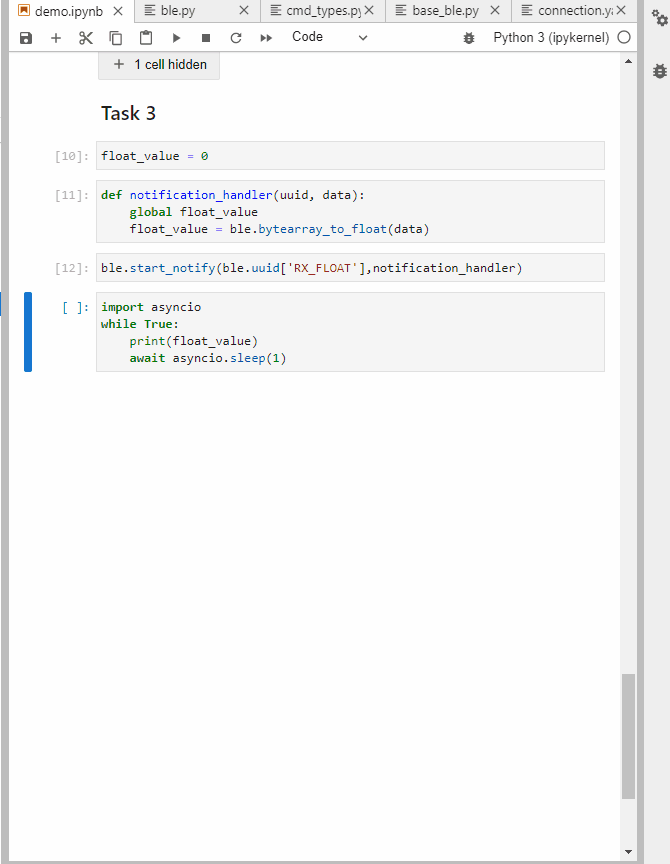

<!DOCTYPE html>
<html lang="en">
    <head>
        <meta charset="utf-8" />
        <meta name="viewport" content="width=device-width, initial-scale=1, shrink-to-fit=no" />
        <meta name="description" content="" />
        <meta name="author" content="" />
        <title>Fast Robots - Ruohan Liu</title>
        <!-- Favicon-->
        <link rel="icon" type="image/x-icon" href="assets/favicon.ico" />
        <!-- Font Awesome icons (free version)-->
        
        <!-- Google fonts-->
        <link href="https://fonts.googleapis.com/css?family=Montserrat:400,700" rel="stylesheet" type="text/css" />
        <link href="https://fonts.googleapis.com/css?family=Lato:400,700,400italic,700italic" rel="stylesheet" type="text/css" />
        <!-- Core theme CSS (includes Bootstrap)-->
        <link href="css/styles.css" rel="stylesheet" />
    </head>
    <body id="page-top">
        <!-- Navigation-->
        <nav class="navbar navbar-expand-lg bg-secondary text-uppercase fixed-top" id="mainNav">
            

                <a class="navbar-brand" href="#page-top">ECE5960: Fast Robots</a>
                <button class="navbar-toggler text-uppercase font-weight-bold bg-primary text-white rounded" type="button" data-bs-toggle="collapse" data-bs-target="#navbarResponsive" aria-controls="navbarResponsive" aria-expanded="false" aria-label="Toggle navigation">
                    Menu
                    <i class="fas fa-bars"></i>
                </button>
                

                    <ul class="navbar-nav ms-auto">
                        <li class="nav-item mx-0 mx-lg-1"><a class="nav-link py-3 px-0 px-lg-3 rounded" href="#labs">LABS</a></li>
                        <li class="nav-item mx-0 mx-lg-1"><a class="nav-link py-3 px-0 px-lg-3 rounded" href="#about">About</a></li>
                        <li class="nav-item mx-0 mx-lg-1"><a class="nav-link py-3 px-0 px-lg-3 rounded" href="#contact">Contact</a></li>
                    </ul>
                

            

        </nav>
        <!-- Masthead-->
        <header class="masthead bg-primary text-white text-center">
            

                <!-- Masthead Avatar Image-->
                <!--  -->
                <!-- Masthead Heading-->
                <h1 class="masthead-heading text-uppercase mb-0">RUOHAN LIU</h1>
                <!-- Icon Divider-->
                

                    

                    
<i class="fas fa-star"></i>

                    

                

                <!-- Masthead Subheading-->
                
ECE MEng student

                
rl592@cornell.edu - Ithaca, NY

                
Course : ECE 5960 - Fast Robots - Spring 2022

            

        </header>
        <!-- Portfolio Section-->
        <section class="page-section labs" id="labs">
            

                <!-- Portfolio Section Heading-->
                <h2 class="page-section-heading text-center text-uppercase text-secondary mb-0">LABS</h2>
                <!-- Icon Divider-->
                

                    

                    
<i class="fas fa-star"></i>

                    

                

                <!-- Portfolio Grid Items-->
                

                    <!-- Portfolio Item 1-->
                    

                        

                            

                                
<i class="fas fa-plus fa-3x"></i>

                            

                            

                            <h3 class=" text-center  mb-0">Lab1 : Artemis</h3>
                            
                        

                    

                    <!-- Portfolio Item 2-->
                    

                        

                            

                                
<i class="fas fa-plus fa-3x"></i>

                            

                            <!--  -->
                            
                            <h3 class=" text-center  mb-0">Lab2 : Bluetooth</h3>

                        

                    

                    <!-- Portfolio Item 3-->
                    

                        

                            

                                
<i class="fas fa-plus fa-3x"></i>

                            

                            
                            <h3 class=" text-center  mb-0">Lab3 : Sensors</h3>
                        

                    

                    <!-- Portfolio Item 4-->
                    

                        

                            

                                
<i class="fas fa-plus fa-3x"></i>

                            

                            
                            <h3 class=" text-center  mb-0">Lab4 : Characterize your car</h3>
                        

                    

                    <!-- Portfolio Item 5-->
                    

                        

                            

                                
<i class="fas fa-plus fa-3x"></i>

                            

                            
                            <h3 class=" text-center  mb-0">Lab5 : Motor driver and open loop control</h3>

                        

                    

                    <!-- Portfolio Item 6-->
                    

                        

                            

                                
<i class="fas fa-plus fa-3x"></i>

                            

                            
                            <h3 class=" text-center  mb-0">Lab6 : PID speed control</h3>

                        

                    

                    <!-- Portfolio Item 7-->
                    

                        

                            

                                
<i class="fas fa-plus fa-3x"></i>

                            

                            

                            <h3 class=" text-center  mb-0">Lab7 : Kalman filters</h3>
                            
                        

                    

                    <!-- Portfolio Item 8-->
                    

                        

                            

                                
<i class="fas fa-plus fa-3x"></i>

                            

                            
                            <h3 class=" text-center  mb-0">Lab8 : Stunts</h3>

                        

                    

                    <!-- Portfolio Item 9-->
                    

                        

                            

                                
<i class="fas fa-plus fa-3x"></i>

                            

                            
                            <h3 class=" text-center  mb-0">Lab9 : Mapping</h3>
                        

                    

                    <!-- Portfolio Item 10-->
                    

                        

                            

                                
<i class="fas fa-plus fa-3x"></i>

                            

                            
                            <h3 class=" text-center  mb-0">Lab10 : Simulator</h3>
                        

                    

                    <!-- Portfolio Item 11-->
                    

                        

                            

                                
<i class="fas fa-plus fa-3x"></i>

                            

                            
                            <h3 class=" text-center mb-0">Lab11 : Localization (sim)</h3>

                        

                    

                    <!-- Portfolio Item 12-->
                    

                        

                            

                                
<i class="fas fa-plus fa-3x"></i>

                            

                            
                            <h3 class=" text-center  mb-0">Lab12 : Localization (real)</h3>

                        

                    

                    <!-- Portfolio Item 13-->
                    

                        

                            

                                
<i class="fas fa-plus fa-3x"></i>

                            

                            
                            <h3 class=" text-center mb-0">Lab13 : Planning and Execution</h3>

                        

                    

                

            

        </section>
        <!-- About Section-->
        <section class="page-section bg-primary text-white mb-0" id="about">
            

                <!-- About Section Heading-->
                <h2 class="page-section-heading text-center text-uppercase text-white">About</h2>
                <!-- Icon Divider-->
                

                    

                    
<i class="fas fa-star"></i>

                    

                

                <!-- About Section Content-->
                

                    

Freelancer is a free bootstrap theme created by Start Bootstrap. The download includes the complete source files including HTML, CSS, and JavaScript as well as optional SASS stylesheets for easy customization.

                    

You can create your own custom avatar for the masthead, change the icon in the dividers, and add your email address to the contact form to make it fully functional!

                

                <!-- About Section Button-->
                

                    <a class="btn btn-xl btn-outline-light" href="https://startbootstrap.com/theme/freelancer/">
                        <i class="fas fa-download me-2"></i>
                        Free Download!
                    </a>
                

            

        </section>
        <!-- Contact Section-->
        <section class="page-section" id="contact">
            

                <!-- Contact Section Heading-->
                <h2 class="page-section-heading text-center text-uppercase text-secondary mb-0">Contact Me</h2>
                <!-- Icon Divider-->
                

                    

                    
<i class="fas fa-star"></i>

                    

                

                <!-- Contact Section Form-->
                

                    

                        <!-- * * * * * * * * * * * * * * *-->
                        <!-- * * SB Forms Contact Form * *-->
                        <!-- * * * * * * * * * * * * * * *-->
                        <!-- This form is pre-integrated with SB Forms.-->
                        <!-- To make this form functional, sign up at-->
                        <!-- https://startbootstrap.com/solution/contact-forms-->
                        <!-- to get an API token!-->
                        <form id="contactForm" data-sb-form-api-token="API_TOKEN">
                            <!-- Name input-->
                            

                                <input class="form-control" id="name" type="text" placeholder="Enter your name..." data-sb-validations="required" />
                                <label for="name">Full name</label>
                                
A name is required.

                            

                            <!-- Email address input-->
                            

                                <input class="form-control" id="email" type="email" placeholder="name@example.com" data-sb-validations="required,email" />
                                <label for="email">Email address</label>
                                
An email is required.

                                
Email is not valid.

                            

                            <!-- Phone number input-->
                            

                                <input class="form-control" id="phone" type="tel" placeholder="(123) 456-7890" data-sb-validations="required" />
                                <label for="phone">Phone number</label>
                                
A phone number is required.

                            

                            <!-- Message input-->
                            

                                <textarea class="form-control" id="message" type="text" placeholder="Enter your message here..." style="height: 10rem" data-sb-validations="required"></textarea>
                                <label for="message">Message</label>
                                
A message is required.

                            

                            <!-- Submit success message-->
                            <!---->
                            <!-- This is what your users will see when the form-->
                            <!-- has successfully submitted-->
                            

                                

                                    
Form submission successful!

                                    To activate this form, sign up at
                                     
                                    <a href="https://startbootstrap.com/solution/contact-forms">https://startbootstrap.com/solution/contact-forms</a>
                                

                            

                            <!-- Submit error message-->
                            <!---->
                            <!-- This is what your users will see when there is-->
                            <!-- an error submitting the form-->
                            

Error sending message!

                            <!-- Submit Button-->
                            <button class="btn btn-primary btn-xl disabled" id="submitButton" type="submit">Send</button>
                        </form>
                    

                

            

        </section>
        <!-- Footer-->
        <footer class="footer text-center">
            

                

                    <!-- Footer Location-->
                    

                        <h4 class="text-uppercase mb-4">Location</h4>
                        

                            2215 John Daniel Drive
                             
                            Clark, MO 65243
                        

                    

                    <!-- Footer Social Icons-->
                    

                        <h4 class="text-uppercase mb-4">Around the Web</h4>
                        <a class="btn btn-outline-light btn-social mx-1" href="#!"><i class="fab fa-fw fa-facebook-f"></i></a>
                        <a class="btn btn-outline-light btn-social mx-1" href="#!"><i class="fab fa-fw fa-twitter"></i></a>
                        <a class="btn btn-outline-light btn-social mx-1" href="#!"><i class="fab fa-fw fa-linkedin-in"></i></a>
                        <a class="btn btn-outline-light btn-social mx-1" href="#!"><i class="fab fa-fw fa-dribbble"></i></a>
                    

                    <!-- Footer About Text-->
                    

                        <h4 class="text-uppercase mb-4">About Freelancer</h4>
                        

                            Freelance is a free to use, MIT licensed Bootstrap theme created by
                            <a href="http://startbootstrap.com">Start Bootstrap</a>
                            .
                        

                    

                

            

        </footer>
        <!-- Copyright Section-->
        

            
<small>Copyright &copy; Your Website 2021</small>

        

        <!-- Portfolio Modals-->
        <!-- Portfolio Modal 1-->
        

            

                

                    
<button class="btn-close" type="button" data-bs-dismiss="modal" aria-label="Close"></button>

                    

                        

                            

                                

                                    <!-- Portfolio Modal - Title-->
                                    <h2 class="portfolio-modal-title text-secondary text-uppercase mb-0">Lab1:The Artemis board</h2>
                                    <!-- Icon Divider-->
                                    

                                        

                                        
<i class="fas fa-star"></i>

                                        

                                    

                                    <h3 class=" text-center  mb-0">Blink it up</h3>
                                    
I use PWM to control the duty of LED. In loop function, the duty of LED is changed every 10 rounds.

                                    <code >if (cnt == 10){cnt  =  0;} 
                                        if (light_on) {duty++;} 
                                        else {duty--;}}   
                                      if (duty == 10) {light_on = 0;} 
                                      if (!duty) {light_on = 1;} 
                                      cnt++; 
                                      digitalWrite(LED_BUILTIN, HIGH);   // turn the LED on (HIGH is the voltage level) 
                                      delay(duty);                       // wait for duty/1000 second 
                                      digitalWrite(LED_BUILTIN, LOW);    // turn the LED off by making the voltage LOW 
                                      delay(10-duty);                    // wait for (10-duty)/1000 second
                                  </code>
                                    

                                        <video width="400" height="375" class="fullscreen-video" controls="">
                                            <source class="text-center" src="assets/video/lab1/blinkItUp.mp4" type="video/mp4">
                                        </video>
                                    

                                    

                                        

                                    

                                    <h3 class=" text-center  mb-0">Serial</h3>
                                    
Setup function: define the pin for UART and baud rate  
                                        Loop function: read the data from UART port and send to it.

                                    

                                        <video width="400" height="375" class="fullscreen-video" controls="">
                                            <source class="text-center" src="assets/video/lab1/serial.mp4" type="video/mp4">
                                        </video>
                                    

                                    

                                        

                                    

                                    <h3 class=" text-center  mb-0">Analog Read</h3>
                                    
First initialize ADC pin for temperature detection and UART port for data transmission. 
                                        Then loop function reads the temperature from ADC pin, send to UART port and repeat over and over again.

                                    

                                        <video width="400" height="375" class="fullscreen-video" controls="">
                                            <source class="text-center" src="assets/video/lab1/analogRead.mp4" type="video/mp4">
                                        </video>
                                    

                                    

                                        <video width="400" height="375" class="fullscreen-video" controls="">
                                            <source class="text-center" src="assets/video/lab1/analogRead_PC.mp4" type="video/mp4">
                                        </video>
                                    

                                    

                                        

                                    

                                    <h3 class=" text-center  mb-0">MicrophoneOutput</h3>
                                    
1.	Initialize UART and start PDM interrupts.  
                                        2.	Get audio data from pdmDataBuffer. 
                                        3.	Perform FFT on audio data. 
                                        4.	Output the loudest frequency. 
                                        

                                    

                                        <video width="400" height="375" class="fullscreen-video" controls="">
                                            <source class="text-center" src="assets/video/lab1/MicrophoneOutput.mp4" type="video/mp4">
                                        </video>
                                    

                                    

                                        

                                    

                                    <h3 class=" text-center  mb-0">Turn on the LED when you whistle</h3>
                                    
1.	Initialize UART and LEDPIN and start PDM interrupts.  
                                        2.	Get audio data from pdmDataBuffer. 
                                        3.	If the sum of audio data is above the threshold, set LED on, otherwise off.                                      
                                        

                                    

                                        <video width="400" height="375" class="fullscreen-video" controls="">
                                            <source class="text-center" src="assets/video/lab1/whistle.mp4" type="video/mp4">
                                        </video>
                                    

                                    <!-- Portfolio Modal - Image-->
                                    <!--  -->
                                    <!-- Portfolio Modal - Text-->
                                    

                                        

                                    

                                    <button class="btn btn-primary" href="#!" data-bs-dismiss="modal">
                                        <i class="fas fa-times fa-fw"></i>
                                        Close Window
                                    </button>
                                

                            

                        

                    

                

            

        

        <!-- Portfolio Modal 2-->
        

            

                

                    
<button class="btn-close" type="button" data-bs-dismiss="modal" aria-label="Close"></button>

                    <!-- 
 -->
                        

                            <!-- 
 -->
                                

                                    <!-- Portfolio Modal - Title-->
                                    <h3 class="portfolio-modal-title text-secondary text-center mb-0">Task 1</h3>
                                    
Send an ECHO command with a string value from the computer to the Artemis board, and receive an augmented string on the computer.

                                    <code >
                                        char char_arr[MAX_MSG_SIZE]; 

                                        // Extract the next value from the command string as a character array 
                                        success = robot_cmd.get_next_value(char_arr); 
                                        if (!success) 
                                            return; 
                                            
                                        tx_estring_value.clear(); 
                                        tx_estring_value.append("Robot says -> "); 
                                        tx_estring_value.append(char_arr); 
                                        tx_estring_value.append(":)"); 
                                        
                                        tx_characteristic_string.writeValue(tx_estring_value.c_str()); 
                                        Serial.println(tx_estring_value.c_str());  
                                    </code>
                                    
In the Arduino side, the cmd_type in robot command send by computer is first extracted, 
                                        then the message of robot command is extracted, stored and inserted into tx_estring_value. 
                                        After that, Artemis will update this tx_characteristic_string in "RX_STRING" service where 
                                        my computer as a central device can read it

                                    
                                    
                                    

                                        

                                    

                                    <h3 class="portfolio-modal-title text-secondary text-center mb-0">Task 2</h3>
                                    
Send three floats to the Artemis board using the SEND_THREE_FLOATS command and extract the three float values in the Arduino sketch.

                                    <code >
                                        float f_a, f_b, f_c; 

                                        // Extract the next value from the command string as an integer 
                                        success = robot_cmd.get_next_value(f_a); 
                                        if (!success) 
                                            return; 
                            
                                        // Extract the next value from the command string as an integer 
                                        success = robot_cmd.get_next_value(f_b); 
                                        if (!success) 
                                            return; 
                                            
                                        // Extract the next value from the command string as an integer 
                                        success = robot_cmd.get_next_value(f_c); 
                                        if (!success) 
                                            return; 
                                        Serial.print("Three floats: "); 
                                        Serial.print(f_a); 
                                        Serial.print(", "); 
                                        Serial.print(f_b); 
                                        Serial.print(", "); 
                                        Serial.println(f_c); 
                                        break;
                                    </code>
                                    
In the Arduino side, the cmd_type in robot command send by computer is first extracted, 
                                        then three float values are extracted through "robot_cmd.get_next_value()" function in order.
                                        After that, these float numbers are displayed on the serial monitor by "Serial.print()" function

                                    
                                    
                                    

                                        

                                    

                                    <h3 class="portfolio-modal-title text-secondary text-center mb-0">Task 3</h3>
                                    
Setup a notification handler in Python to receive the float value 
                                        from the Artemis board. In the callback function, store the float value into a (global) variable 
                                        such that it is updated every time the characteristic value changes. This way we do not have to 
                                        explicitly use the receive_float() function to get the float value.

                                    
                                    

                                        First define a global variable, float_value, and define notification_handler callback function in 
                                        which the float_value variable gets updated by ble.bytearray_to_float function. And then start the
                                         notify. Using asyncio.sleep from asyncio libaray, we can monitor the value of float_value when the 
                                         characteristic of RX_FLOAT service is updated.
                                    

                                    
                                    
                                    

                                        

                                    

                                    <h3 class="portfolio-modal-title text-secondary text-center mb-0">Task 4</h3>
                                    
Briefly explain the difference between the two approaches to receiving a float value. 

                                    
A single float takes 4 bytes and a single string of length 1 takes 1 byte. 
                                        When sending data from Artemis to computer, the less number of bytes being sent, the more efficient the transmission would be.
                                        So when the number of bytes of data in string format is less than that in float format, the second approach is preferable in which 
                                        the rest of work of converting string to float is done by computer. Otherwise, the first approach is better.
                                    

                                    

                                        

                                    

                                    <h3 class="portfolio-modal-title text-secondary text-center mb-0">Effective Data Rate</h3>
                                    
Send a message from the computer and receive a reply from the Artemis board.
                                         Note the respective times for each event, calculate the data rate. 

                                    
                                    
I created a dataRate_handler callback function to calculate the time between message being sent and being received by computer.
                                        And I also commented out th write_data function in Artemis to ensure the accuracy.
                                    

                                    
                                    
From this plot, we can estimate that the time consumed is proportional to the number of bytes of a message and ranges from 0.2 second to 0.8 second with respect to the number of bytes of a message.

                                            
                                    

                                        

                                    

                                    <h3 class="portfolio-modal-title text-secondary text-center mb-0">Reliability</h3>
                                    
What happens when you send data at a higher rate from the robot to the computer? Does the computer read all the data published (without missing anything) from the Artemis board?

                                    
                                    
In Artemis, I set the interval to 0 in write_data function. This means that the data will be updated at a very high rate. And in my computer, I wrote another notification_handler
                                        to read and store the updated data from bulletin board. By this way, I was able to record the number of data sent by the robot and the number of data received by my computer. As seen in above gif 
                                        file, although data is sent at a higher rate, my computer is still able to read all the data without missing anything.
                                    

                                

                            <!-- 
 -->
                        <!-- 
 -->
                    

                

            

        

        <!-- Portfolio Modal 3-->
        

            

                

                    
<button class="btn-close" type="button" data-bs-dismiss="modal" aria-label="Close"></button>

                    

                        

                            

                                

                                    <!-- Portfolio Modal - Title-->
                                    <h2 class="portfolio-modal-title text-secondary text-uppercase mb-0">Circus Tent</h2>
                                    <!-- Icon Divider-->
                                    

                                        

                                        
<i class="fas fa-star"></i>

                                        

                                    

                                    <!-- Portfolio Modal - Image-->
                                    
                                    <!-- Portfolio Modal - Text-->
                                    
Lorem ipsum dolor sit amet, consectetur adipisicing elit. Mollitia neque assumenda ipsam nihil, molestias magnam, recusandae quos quis inventore quisquam velit asperiores, vitae? Reprehenderit soluta, eos quod consequuntur itaque. Nam.

                                    <button class="btn btn-primary" href="#!" data-bs-dismiss="modal">
                                        <i class="fas fa-times fa-fw"></i>
                                        Close Window
                                    </button>
                                

                            

                        

                    

                

            

        

        <!-- Portfolio Modal 4-->
        

            

                

                    
<button class="btn-close" type="button" data-bs-dismiss="modal" aria-label="Close"></button>

                    

                        

                            

                                

                                    <!-- Portfolio Modal - Title-->
                                    <h2 class="portfolio-modal-title text-secondary text-uppercase mb-0">Controller</h2>
                                    <!-- Icon Divider-->
                                    

                                        

                                        
<i class="fas fa-star"></i>

                                        

                                    

                                    <!-- Portfolio Modal - Image-->
                                    
                                    <!-- Portfolio Modal - Text-->
                                    
Lorem ipsum dolor sit amet, consectetur adipisicing elit. Mollitia neque assumenda ipsam nihil, molestias magnam, recusandae quos quis inventore quisquam velit asperiores, vitae? Reprehenderit soluta, eos quod consequuntur itaque. Nam.

                                    <button class="btn btn-primary" href="#!" data-bs-dismiss="modal">
                                        <i class="fas fa-times fa-fw"></i>
                                        Close Window
                                    </button>
                                

                            

                        

                    

                

            

        

        <!-- Portfolio Modal 5-->
        

            

                

                    
<button class="btn-close" type="button" data-bs-dismiss="modal" aria-label="Close"></button>

                    

                        

                            

                                

                                    <!-- Portfolio Modal - Title-->
                                    <h2 class="portfolio-modal-title text-secondary text-uppercase mb-0">Locked Safe</h2>
                                    <!-- Icon Divider-->
                                    

                                        

                                        
<i class="fas fa-star"></i>

                                        

                                    

                                    <!-- Portfolio Modal - Image-->
                                    
                                    <!-- Portfolio Modal - Text-->
                                    
Lorem ipsum dolor sit amet, consectetur adipisicing elit. Mollitia neque assumenda ipsam nihil, molestias magnam, recusandae quos quis inventore quisquam velit asperiores, vitae? Reprehenderit soluta, eos quod consequuntur itaque. Nam.

                                    <button class="btn btn-primary" href="#!" data-bs-dismiss="modal">
                                        <i class="fas fa-times fa-fw"></i>
                                        Close Window
                                    </button>
                                

                            

                        

                    

                

            

        

        <!-- Portfolio Modal 6-->
        

            

                

                    
<button class="btn-close" type="button" data-bs-dismiss="modal" aria-label="Close"></button>

                    

                        

                            

                                

                                    <!-- Portfolio Modal - Title-->
                                    <h2 class="portfolio-modal-title text-secondary text-uppercase mb-0">Submarine</h2>
                                    <!-- Icon Divider-->
                                    

                                        

                                        
<i class="fas fa-star"></i>

                                        

                                    

                                    <!-- Portfolio Modal - Image-->
                                    
                                    <!-- Portfolio Modal - Text-->
                                    
Lorem ipsum dolor sit amet, consectetur adipisicing elit. Mollitia neque assumenda ipsam nihil, molestias magnam, recusandae quos quis inventore quisquam velit asperiores, vitae? Reprehenderit soluta, eos quod consequuntur itaque. Nam.

                                    <button class="btn btn-primary" href="#!" data-bs-dismiss="modal">
                                        <i class="fas fa-times fa-fw"></i>
                                        Close Window
                                    </button>
                                

                            

                        

                    

                

            

        

        <!-- Bootstrap core JS-->
        
        <!-- Core theme JS-->
        
        <!-- * * * * * * * * * * * * * * * * * * * * * * * * * * * * * * * * * * * * * * * *-->
        <!-- * *                               SB Forms JS                               * *-->
        <!-- * * Activate your form at https://startbootstrap.com/solution/contact-forms * *-->
        <!-- * * * * * * * * * * * * * * * * * * * * * * * * * * * * * * * * * * * * * * * *-->
        
    </body>
</html>
